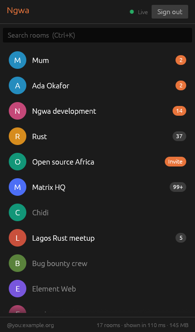

# Ngwa

**A fast, native Matrix client.** Ngwa is a lightweight desktop client for
[Matrix](https://matrix.org), written in Rust. No browser engine, no Electron:
it should start in well under a second and use a fraction of the memory of
web-based clients.

*Ngwa* is Igbo for "quick" — as in *ngwa ngwa*, "hurry up".

> **Status: early development.** Ngwa signs in and shows a live room list in
> a desktop window. Opening rooms and sending messages comes next, so it is
> not ready for daily use yet.

<p align="center"></p>

## How it works

- **[matrix-rust-sdk](https://github.com/matrix-org/matrix-rust-sdk)** speaks
  the Matrix protocol: sign-in, sync, rooms, and (later) end-to-end encryption.
- **Sliding sync** loads only what is on screen, so your room list appears
  almost immediately instead of after a long first sync. Your homeserver must
  support it; matrix.org and current Synapse releases do.
- **[egui](https://github.com/emilk/egui)** draws the interface with OpenGL,
  natively on Linux, macOS, and Windows. There is no browser engine.
- **The window never waits on the network.** Syncing runs on background
  threads; the window only redraws when something changes.
- **Your session stays in the system credential store** (Keychain on macOS,
  Credential Manager on Windows, Secret Service on Linux), or in an owner-only
  file where there is none. Local data is kept in an encrypted database.

## Roadmap

**v0.1 — a daily driver for unencrypted rooms**

- [x] Milestone 1: sign in with a password, resume the session, list rooms
- [x] Milestone 2: the room list in a desktop window, live, with search
- [ ] Milestone 3: open a room, read the timeline, scroll back, send and reply

**v0.2 — end-to-end encryption:** device verification, key backup and
recovery, so encrypted DMs work.

**Later:** media, reactions, edits, threads, notifications, packaging, and
automatic updates.

## Try it

You need [Rust](https://rustup.rs) 1.96 or newer.

```sh
git clone https://github.com/kingsmandralph/ngwa
cd ngwa
cargo install --path .   # builds and installs the `ngwa` command
ngwa                     # open the app
```

The terminal commands still work too: `ngwa login`, `ngwa rooms` and
`ngwa logout`. To look around without an account, run `ngwa --demo`.

After pulling updates, run `cargo install --path .` again.

When signing in, give your full Matrix ID (like `@you:matrix.org`). With
just a username, the homeserver defaults to matrix.org.

Where Linux has no credential store (WSL, servers, minimal desktops), Ngwa
saves the session in a file only you can read instead. The first build takes
a few minutes; later builds are fast.

Encrypted rooms appear in the list, but reading their messages arrives in v0.2.

## Contributing

Issues and pull requests are welcome. Run `cargo fmt` and `cargo clippy`
before opening a pull request. `cargo run -- --demo` opens the window with
made-up rooms, which is the quickest way to work on the interface.

## License

Licensed under either of [Apache License, Version 2.0](LICENSE-APACHE) or
[MIT license](LICENSE-MIT), at your option.

Ngwa is an independent project and is not affiliated with or endorsed by The
Matrix.org Foundation. Matrix is a trademark of The Matrix.org Foundation.
